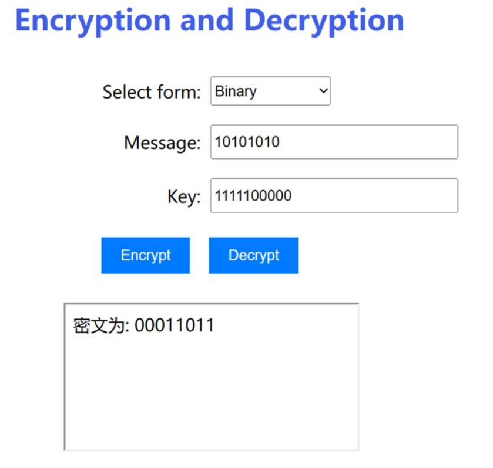
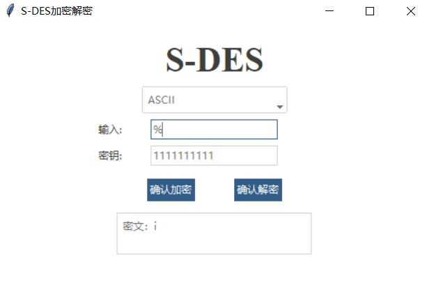

# 作业1：S-DES算法实现

### 第一关：基本测试
加密界面：

图1 GUI界面

选择明文编码：

图2 选择编码

输入明文10101010, 密钥0101010101, 确认加密：

图3 Binary加密结果

若输入明文不符合要求则弹出警告（例如输入1）：

图4 明文不符合要求

若输入密钥不符合要求则弹出警告（例如输入8bit）：

图5 密钥不符合要求

### 第二关：交叉测试

参考小组的密钥和明文加密结果如下图：

图6 另一组加密

我们明密文加密如下图：

图7 本组加密

解密如下：  

图8 本组解密

### 第三关：扩展功能

对ASCII编码字符串加解密

如以明文为：% ，密钥为：1111111111 ，得到密文如下图：

图9 ASCII加密

### 第四关：暴力破解

对明文00000011和密文11001110进行暴力破解:

图10 暴力破解输出结果

可见得到密钥如下:  
[1000011101, 101110000, 1100011101, 1111100000]

单线程破解时间: 0.044秒  
多线程破解时间: 0.053秒

### 第五关：封闭测试

对于密文01011111，随机给出明文分组，例如[10100010, 00100000]，可得到不同的密钥，输出结果截图为：

图11 封闭测试输出结果

因此对于密文01011111，可以由不同的明文和密钥加密得到，由此推到以下结论：
-  对于一个明文密文对，存在不止一个密钥Key可以成功解密该对。
-  对于明文空间中的多个明文分组Pn，存在不同的密钥Ki和Kj，使得加密得到相同的密文Cn。